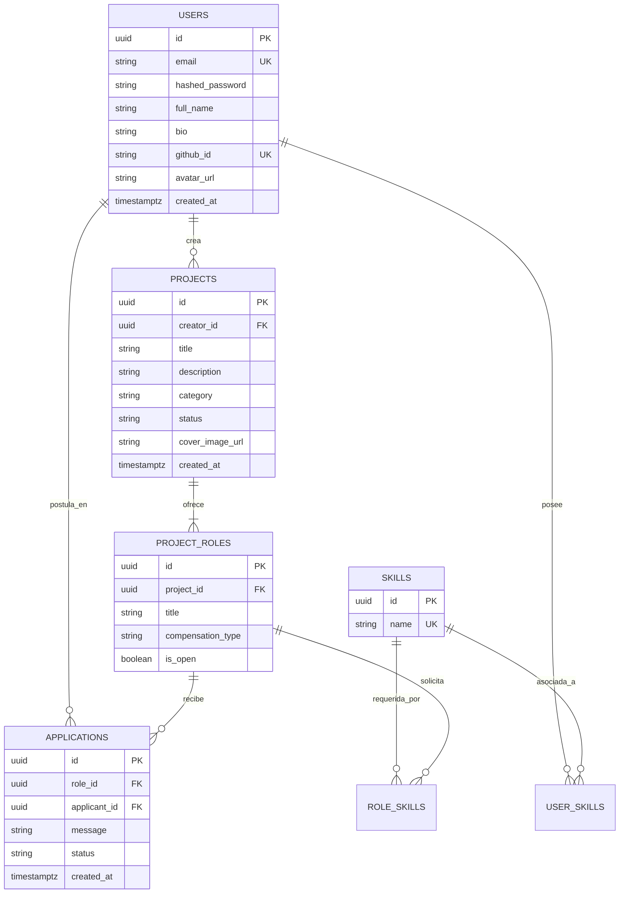

# Especificación del Diseño de Base de Datos (PostgreSQL)
**Proyecto:** Aunary  
**Estado:** Propuesta de Arquitectura de Datos  
**Motor de Base de Datos:** PostgreSQL 15+

Este documento detalla el esquema físico de la base de datos relacional para Aunary. Todas las tablas principales emplean identificadores únicos universales (UUID v4) para mitigar la enumeración de recursos y facilitar la portabilidad de los datos en entornos distribuidos.

---

## 1. Diccionario de Datos (Esquema de Tablas)

### Tabla: `users`
Almacena la información de perfil tanto de los creadores como de los colaboradores.

| Campo | Tipo de Dato | Restricciones | Descripción |
| :--- | :--- | :--- | :--- |
| `id` | UUID | PRIMARY KEY, DEFAULT `gen_random_uuid()` | Identificador único del usuario. |
| `email` | VARCHAR(255) | UNIQUE, NOT NULL | Correo electrónico principal. (Indexado) |
| `hashed_password` | VARCHAR(255) | NULLABLE | Contraseña hasheada (nulo si el registro es vía OAuth). |
| `full_name` | VARCHAR(100) | NOT NULL | Nombre y apellido del usuario. |
| `bio` | TEXT | NULLABLE | Breve descripción biográfica. |
| `avatar_url` | VARCHAR(511) | NULLABLE | URL de la imagen de perfil (almacenada en Cloudinary). |
| `github_id` | VARCHAR(100) | UNIQUE, NULLABLE | Identificador interno de GitHub (para OAuth). (Indexado) |
| `github_username`| VARCHAR(100) | NULLABLE | Nombre de usuario de GitHub. |
| `linkedin_url` | VARCHAR(511) | NULLABLE | URL del perfil de LinkedIn. |
| `portfolio_url` | VARCHAR(511) | NULLABLE | URL de sitio web o portafolio personal. |
| `created_at` | TIMESTAMPTZ | NOT NULL, DEFAULT `NOW()` | Fecha y hora de registro con zona horaria. |
| `updated_at` | TIMESTAMPTZ | NOT NULL, DEFAULT `NOW()` | Fecha y hora de última actualización. |

---

### Tabla: `skills`
Catálogo normalizado de tecnologías y habilidades.

| Campo | Tipo de Dato | Restricciones | Descripción |
| :--- | :--- | :--- | :--- |
| `id` | UUID | PRIMARY KEY, DEFAULT `gen_random_uuid()` | Identificador único de la habilidad. |
| `name` | VARCHAR(50) | UNIQUE, NOT NULL | Nombre de la tecnología/habilidad. (Indexado) |

---

### Tabla: `user_skills` (Asociación Muchos a Muchos)
Relaciona a los usuarios con sus respectivas habilidades.

| Campo | Tipo de Dato | Restricciones | Descripción |
| :--- | :--- | :--- | :--- |
| `user_id` | UUID | FOREIGN KEY -> `users(id)` ON DELETE CASCADE | ID del usuario. (Parte de PK compuesta) |
| `skill_id` | UUID | FOREIGN KEY -> `skills(id)` ON DELETE CASCADE | ID de la habilidad. (Parte de PK compuesta) |

*Nota: La clave primaria compuesta es `(user_id, skill_id)`.*

---

### Tabla: `projects`
Proyectos creados por los usuarios en la plataforma.

| Campo | Tipo de Dato | Restricciones | Descripción |
| :--- | :--- | :--- | :--- |
| `id` | UUID | PRIMARY KEY, DEFAULT `gen_random_uuid()` | Identificador único del proyecto. |
| `creator_id` | UUID | FOREIGN KEY -> `users(id)` ON DELETE CASCADE | Creador del proyecto. |
| `title` | VARCHAR(150) | NOT NULL | Título del proyecto. (Indexado) |
| `description` | TEXT | NOT NULL | Descripción extendida. |
| `category` | VARCHAR(50) | NOT NULL | Categoría del proyecto (ej: 'SaaS', 'AI', 'Web3'). (Indexado) |
| `status` | VARCHAR(30) | NOT NULL, DEFAULT 'idea' | Estado del proyecto. (Indexado) |
| `cover_image_url` | VARCHAR(511) | NULLABLE | Imagen de portada (almacenada en Cloudinary). |
| `created_at` | TIMESTAMPTZ | NOT NULL, DEFAULT `NOW()` | Fecha de creación del proyecto. |
| `updated_at` | TIMESTAMPTZ | NOT NULL, DEFAULT `NOW()` | Fecha de última actualización. |

*Restricción CHECK para `status`:* Debe ser uno de: `'idea'`, `'mvp'`, `'in_progress'`, `'completed'`.

---

### Tabla: `project_roles`
Puestos vacantes o posiciones dentro de un proyecto específico.

| Campo | Tipo de Dato | Restricciones | Descripción |
| :--- | :--- | :--- | :--- |
| `id` | UUID | PRIMARY KEY, DEFAULT `gen_random_uuid()` | Identificador único del rol. |
| `project_id` | UUID | FOREIGN KEY -> `projects(id)` ON DELETE CASCADE | Proyecto al que pertenece la vacante. |
| `title` | VARCHAR(100) | NOT NULL | Título del puesto (ej. 'Backend Developer'). |
| `description` | TEXT | NULLABLE | Responsabilidades o especificaciones del rol. |
| `compensation_type`| VARCHAR(30)| NOT NULL, DEFAULT 'pro_bono' | Tipo de compensación de la posición. |
| `is_open` | BOOLEAN | NOT NULL, DEFAULT TRUE | Define si la vacante sigue disponible. |
| `created_at` | TIMESTAMPTZ | NOT NULL, DEFAULT `NOW()` | Fecha de creación de la vacante. |

*Restricción CHECK para `compensation_type`:* Debe ser uno de: `'equity'`, `'pro_bono'`, `'paid'`.

---

### Tabla: `role_skills` (Asociación Muchos a Muchos)
Relaciona los requisitos técnicos de un puesto con el catálogo de habilidades.

| Campo | Tipo de Dato | Restricciones | Descripción |
| :--- | :--- | :--- | :--- |
| `role_id` | UUID | FOREIGN KEY -> `project_roles(id)` ON DELETE CASCADE | ID del rol. (Parte de PK compuesta) |
| `skill_id` | UUID | FOREIGN KEY -> `skills(id)` ON DELETE CASCADE | ID de la habilidad requerida. (Parte de PK compuesta) |

*Nota: La clave primaria compuesta es `(role_id, skill_id)`.*

---

### Tabla: `applications`
Postulaciones que realizan los colaboradores a las vacantes de un proyecto.

| Campo | Tipo de Dato | Restricciones | Descripción |
| :--- | :--- | :--- | :--- |
| `id` | UUID | PRIMARY KEY, DEFAULT `gen_random_uuid()` | Identificador único de la postulación. |
| `role_id` | UUID | FOREIGN KEY -> `project_roles(id)` ON DELETE CASCADE | Rol al que se postula. |
| `applicant_id` | UUID | FOREIGN KEY -> `users(id)` ON DELETE CASCADE | Usuario que envía la solicitud. |
| `message` | VARCHAR(500) | NULLABLE | Mensaje de presentación / pitch del postulante. |
| `status` | VARCHAR(30) | NOT NULL, DEFAULT 'pending' | Estado actual del proceso de selección. |
| `created_at` | TIMESTAMPTZ | NOT NULL, DEFAULT `NOW()` | Fecha y hora en que se envió la solicitud. |

*Restricción CHECK para `status`:* Debe ser uno de: `'pending'`, `'under_review'`, `'accepted'`, `'rejected'`.  
*Restricción de Unicidad (Unique Constraint):* Un usuario solo puede tener una postulación activa o registrada para un mismo rol (`role_id`, `applicant_id`).

---

## 2. Índices de Rendimiento Propuestos (Indexes)

Para mitigar problemas de rendimiento en lecturas recurrentes y filtros combinados:

```sql
-- Índices para búsquedas de usuarios y autenticación OAuth
CREATE INDEX idx_users_email ON users(email);
CREATE INDEX idx_users_github_id ON users(github_id) WHERE github_id IS NOT NULL;

-- Índices para filtros en el catálogo de proyectos (Feed principal)
CREATE INDEX idx_projects_category ON projects(category);
CREATE INDEX idx_projects_status ON projects(status);
CREATE INDEX idx_projects_title_trgm ON projects USING gin (title gin_trgm_ops); -- Requiere extensión pg_trgm para búsquedas parciales

-- Índice para acelerar la búsqueda de habilidades
CREATE INDEX idx_skills_name ON skills(name);
```

---

## 3. Diagrama Entidad-Relación (ERD)

Este diagrama modela visualmente las tablas y sus relaciones:


